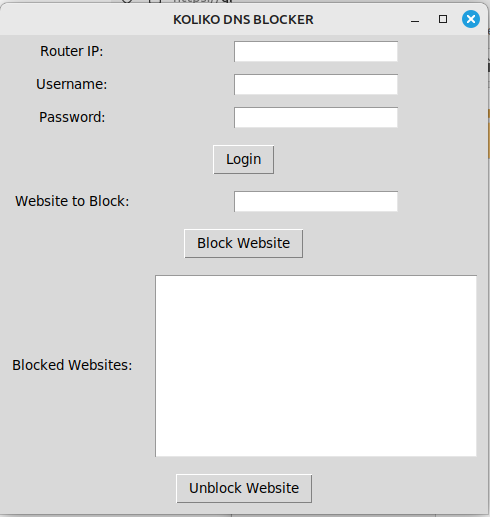
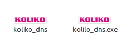

# KOKLIKO DNS Blocker

## Overview
KOKLIKO DNS Blocker is a small but powerful desktop application that enables MikroTik users to easily manage website filtering functionality on their routers. Designed to empower non-technical users, the app simplifies the process of blocking and unblocking specific websites during working hours or at any preferred time.
## Why This Project?

Over the years, I have looked for ways to help small homes and offices manage their productivity by controlling access to distracting websites. One day, a friend asked me if I could set up such functionality for someone. After realizing the technical steps involved, I decided to develop an easy-to-use app so that anyone—even those without technical expertise—could achieve this. That’s how KOKLIKO DNS Blocker was born.
## Platform Compatibility

Routers: Works with all MikroTik routers that have SSH enabled.

Operating Systems: Compatible with Windows, Linux, and macOS.
## How It Works

Enter the MikroTik router’s IP address, username, and password, then log in.

Input the websites you want to block.

To unblock a website, simply click on it and select Unblock.

## Key Features

User-friendly interface for non-technical users.

Block specific websites with just a few clicks.

Unblock sites effortlessly when needed.

Enhances productivity by managing access during working hours.
## Prerequisites

A MikroTik router with SSH enabled.

The IP address, username, and password of the MikroTik device.

The app installed on a Windows, Linux, or macOS machine.
## Installation

Download the latest version of KOKLIKO DNS Blocker.

Run the standalone for your platform (Windows/Linux/macOS).

Launch the app and enter the required router details.
## Usage

Open the application.

Log in with your MikroTik router credentials:

IP Address

Username

Password

Add the websites you want to block in the provided field.

Click Block to restrict access.

To unblock a site, select it from the list and click Unblock.
## Why Use KOKLIKO DNS Blocker?

Saves time by eliminating the need for manual configurations.

Ensures easy website filtering for homes and small offices.

Empowers anyone—even those without technical skills—to control website access.
## Future Improvements

Adding scheduled blocking/unblocking functionality.

Support for additional filtering methods.

Adding auto blocking of all adulting porn sites

## DOWNLOAD HERE
[Download .exe](https://drive.google.com/file/d/1i839dGOX6AAcQx_SON4mOfcezXnVZ7VX/view?usp=sharing "download")

[Download other](https://drive.google.com/file/d/1Hwh8vIYj-trgxBxXaw_DOcxTFd6smGhJ/view?usp=sharing "download")